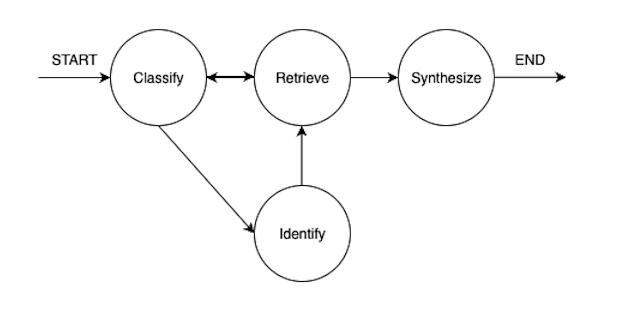

# Research Agent Backend

An AI-powered research agent backend that provides research capabilities across multiple domains including medical, academic, knowledge, and web sources. Built with FastAPI, MongoDB, and LangGraph for advanced query processing and response synthesis.

## Introduction

The Research Agent Backend is an intelligent research assistant that automatically classifies user queries and routes them to appropriate data sources. It leverages multiple research databases and web sources to provide comprehensive, well-cited responses. The system uses LangGraph for workflow orchestration and OpenAI's language models for intelligent query processing and response synthesis.

## Research Graph Structure



The research workflow is orchestrated through a LangGraph-based system that intelligently routes queries through domain-specific processing pipelines.

### Classify
The graph begins with automatic domain classification using OpenAI's language model, which determines whether a query belongs to medical, academic, knowledge, or web domains. 

### Identify
For medical queries, the system includes an additional step to identify and extract relevant medical terms before source retrieval. 

### Retrieve
Once classified and identified, the query is routed to the appropriate source fetchers: PubMed for medical literature, ArXiv for academic papers, Wikipedia for general knowledge, and DuckDuckGo for web search.
If initial results are empty, the system falls back to DuckDuckGo to ensure comprehensive coverage.

### Synthesize
Once sources are successfully retrieved, response synthesis with inline citations is performed, creating a robust research pipeline that guarantees meaningful results across all domains.

## Quick Start with Docker

The easiest way to get started is using Docker Compose, which sets up the application with MongoDB:

### Prerequisites

- Docker and Docker Compose installed
- OpenAI API key
- PubMed API key (optional, for medical research)

### Environment Setup

1. **Clone the repository**:
   ```bash
   git clone <repository-url>
   cd research-agent/backend
   ```

2. **Configure environment variables **:
   The application uses the following environment variables (Please configure in docker-compose.yml):
   - `OPENAI_API_KEY`: Your OpenAI API key
   - `PUBMED_API_KEY`: PubMed API key
   - `PUBMED_EMAIL`: Email for PubMed API

3. **Start the services**:
   ```bash
   docker compose up --build
   ```

4. **Access the application**:
   - API: http://localhost:8000
   - Interactive API docs: http://localhost:8000/docs
   - Redoc API docs: http://localhost:8000/redoc
   - MongoDB: localhost:27017

### Development Mode

For development with live reload:
```bash
docker compose up --build
```

The application will automatically reload when you make changes to the code.

## Project Structure

```
backend/
├── app/
│   ├── main.py                         # FastAPI application entry point
│   ├── api/
│   │   └── agents.py                   # Agent management API endpoints
│   ├── core/
│   │   └── db.py                       # Database connection and initialization
│   ├── data/
│   │   ├── entities/
│   │   │   └── models.py               # MongoDB data models (AgentInDB, ConversationInDB)
│   │   └── repositories/
│   │       └── agent_repository.py     # Repository layer for agent entities
│   ├── fetchers/                       # Research source integrations
│   │   ├── arxiv.py                    # ArXiv academic papers
│   │   ├── pubmed.py                   # PubMed medical literature
│   │   ├── wikipedia.py                # Wikipedia knowledge base
│   │   └── duckduckgo.py               # Web search capabilities
│   ├── models/
│   │   ├── requests.py                 # API request models (AgentCreate, AgentQueries)
│   │   ├── response.py                 # API response models (AgentOut, ConversationsOut)
│   │   └── results.py                  # Research result models (QueryResult, FetcherResult)
│   ├── services/
│   │   └── research_service.py         # Core business logic
│   ├── utils/
│   │   └── llm.py                      # LLM configuration and utilities
│   └── workflows/
│       ├── research_graph.py           # LangGraph workflow orchestration
│       ├── research_state.py           # Workflow state management (ResearchState)
│       └── research_type.py            # Domain classification types (ResearchType)
├── tests/                              # Comprehensive test suite
│   ├── test_agents_api.py              # API endpoint tests
│   ├── test_research_graph.py          # Workflow tests
│   ├── test_research_service.py        # Service layer tests
│   └── test_agent_repository.py        # Repository layer tests
├── docker-compose.yml                  # Multi-service Docker setup
├── Dockerfile                          # Application containerization
├── requirements.txt                    # Python dependencies
└── pytest.ini                          # Test configuration
```
## Testing

### Local Testing
```bash
# Install dependencies
uv pip install -r requirements.txt

# Run all tests with verbose output
pytest -v
```

## Features

### 🔍 Intelligent Research Capabilities

- **Domain-Aware Processing**: Automatically classifies queries into appropriate research domains
- **Multi-Source Integration with Fallback**: 
  - **Medical**: PubMed for clinical and medical literature
  - **Academic**: ArXiv for scientific papers and research
  - **Knowledge**: Wikipedia for general knowledge and facts
  - **Web**: DuckDuckGo for current events and general web information
- **Fallback Mechanism**: Search queries automatically fall back to web search when it returns empty results

### 🤖 AI-Powered Features

- **Smart Query Classification**: Uses OpenAI to determine the most appropriate research domain
- **Medical Term Extraction**: Specialized processing for medical queries
- **Response Synthesis**: Generates comprehensive, well-cited responses
- **Source Attribution**: Provides inline citations and source references

### 🛠 Technical Features

- **FastAPI Framework**: High-performance, modern Python web framework
- **MongoDB Integration**: Scalable document database with Beanie ODM
- **LangGraph Workflows**: Advanced workflow orchestration for research processes
- **Comprehensive Testing**: Full test suite with pytest and httpx
- **Docker Support**: Containerized deployment with multi-service setup
- **RESTful API**: Clean, well-documented API endpoints

## Prerequisites

### System Requirements

- **Python**: 3.12+ (if running locally)
- **Docker**: 20.10+ (recommended)
- **Docker Compose**: 2.0+ (recommended)

### API Keys Required

1. **OpenAI API Key** (Required)
   - Sign up at https://platform.openai.com/
   - Generate an API key
   - Add to environment variables

2. **PubMed API Key** (Required for medical research)
   - Register at https://www.ncbi.nlm.nih.gov/account/
   - Generate API key
   - Add to environment variables

### Dependencies

The application requires the following key dependencies (see `requirements.txt`):

- **Web Framework**: FastAPI, Starlette, Uvicorn
- **Database**: Beanie (MongoDB ODM), Motor, PyMongo
- **AI/ML**: OpenAI, LangGraph, LangChain
- **Research Sources**: ArXiv, Wikipedia, DuckDuckGo, PubMed
- **Testing**: Pytest, HTTPX
- **Utilities**: PyMuPDF, xmltodict
